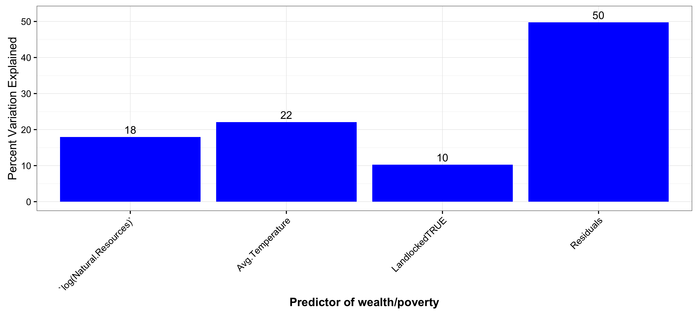
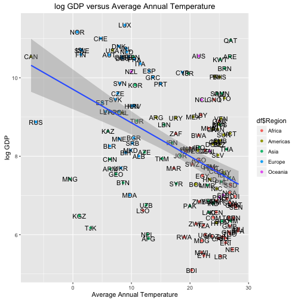

Modeling poverty with predictors outside human control
========================================================
author: Jacques Sauve
date: December 14, 2015

Project for coursera course: Developing Data Products

The problem
========================================================

In trying to understand where wealth comes from or, conversely, why
some countries are poor, I asked myself two questions:

- How many *poor* countries that are *cold* do I know? Very few.
- How many *rich* countries that are *hot* do I know? Very few.

Intuitively, a correlation appears to exist between temperature and poverty (or wealth, measured with per capita GDP).
As a result, I defined my problem: 

- "How much of a country's wealth can be explained by factors that humans cannot control (temperature, for example)?"

The solution
========================================================
- Provide a web-based solution to examine the variation explained by a few predictors chosen to represent things that humans cannot control
- A [shiny application](https://jpsauve.shinyapps.io/poverty) was developed to that end
- Application parameters that can be altered:
    + The desired predictors: Average annual temperature; 
    Average rent obtained from natural resources;
    Whether the country is landlocked or not
    + The desired regions of the world to consider
- Output
    + The variation explained by each predictor
    + Plots showing the data and a model fit 

An example model and output
========================================================

Model: GDP ~ Annual Temperature + Natural Resources + Landlocked

 

- Fully 50% of the variation in wealth is explained by factors humans cannot control!

The effect of temperature
========================================================

 
